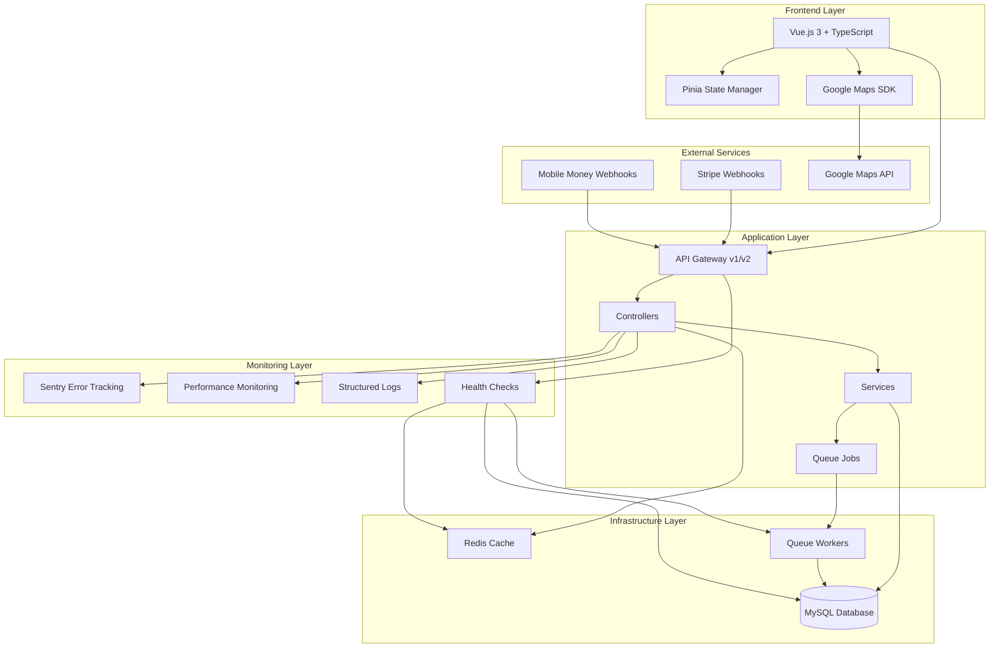

# Design Document: Application Modernization - Performance, Monitoring & Advanced Features

## Overview

This design document outlines the technical approach for modernizing the MAM Tours car rental application to improve performance, reliability, observability, and user experience. The modernization encompasses five major areas:

1. **Database Performance & Optimization**: Strategic indexing, query monitoring, and automated backup systems
2. **Caching & Async Processing**: Redis caching layer and Laravel queue system for improved responsiveness
3. **Monitoring & Observability**: Sentry integration, APM, structured logging, and health checks
4. **API Standards & Integration**: Versioned APIs, webhook support, and OpenAPI documentation
5. **Frontend Advanced Features**: TypeScript migration, Google Maps integration, and Pinia state management

The design maintains backward compatibility with existing functionality while introducing production-ready enhancements that scale with user growth.

## Architecture

### High-Level Architecture



### Technology Stack Additions

**Backend:**
- Redis 6.x+ for caching and session storage
- Laravel Horizon for queue monitoring (optional)
- Sentry SDK for error tracking
- predis/predis or phpredis extension for Redis connectivity

**Frontend:**
- TypeScript 4.x+ for type safety
- Pinia 2.x for state management
- @googlemaps/js-api-loader for Maps integration
- @types/* packages for TypeScript definitions

**DevOps:**
- Railway Redis plugin for managed Redis
- Automated backup scripts with Railway volumes
- Health check monitoring integration

### Design Principles

1. **Backward Compatibility**: All changes maintain existing functionality
2. **Graceful Degradation**: Features degrade gracefully when dependencies fail
3. **Performance First**: Optimize for response time and throughput
4. **Observability**: Comprehensive logging and monitoring at all layers
5. **Type Safety**: TypeScript for compile-time error detection
6. **Separation of Concerns**: Clear boundaries between layers

## Components and Interfaces

### 1. Database Index Manager

**Purpose**: Manage database indexes for optimal query performance

**Implementation**:

```php
// database/migrations/2024_xx_xx_add_performance_indexes.php
class AddPerformanceIndexes extends Migration
{
    public function up()
    {
        Schema::table('cars', function (Blueprint $table) {
            $table->index('isAvailable', 'idx_cars_available');
            $table->index('category', 'idx_cars_category');
            $table->index(['isAvailable', 'category'], 'idx_cars_available_category');
        });
        
        Schema::table('bookings', function (Blueprint $table) {
            $table->index('user_id', 'idx_bookings_user');
            $table->index('car_id', 'idx_bookings_car');
            $table->index('status', 'idx_bookings_status');
            $table->index(['startDate', 'endDate'], 'idx_bookings_dates');
            $table->index(['status', 'startDate'], 'idx_bookings_status_date');
        });
        
        Schema::table('users', function (Blueprint $table) {
            $table->unique('email', 'idx_users_email_unique');
            $table->index('role', 'idx_users_role');
        });
    }
}
```

**Index Strategy**:
- Single-column indexes for frequently filtered columns (status, isAvailable)
- Composite indexes for common query patterns (status + date, available + category)
- Unique indexes for email to enforce constraints and improve lookups

### 2. Query Monitor Service

**Purpose**: Track and log slow database queries

**Interface**:

```php
// app/Services/QueryMonitorService.php
class QueryMonitorService
{
    private const SLOW_QUERY_THRESHOLD = 100; // milliseconds
    
    public function register(): void
    {
        DB::listen(function ($query) {
            if ($query->time > self::SLOW_QUERY_THRESHOLD) {
                $this->logSlowQuery($query);
            }
        });
    }
    
    private function logSlowQuery($query): void
    {
        Log::warning('Slow query detected', [
            'sql' => $query->sql,
            'bindings' => $query->bindings,
            'time' => $query->time,
            'connection' => $query->connectionName,
        ]);
    }
}
```

**Registration**: Add to `AppServiceProvider::boot()`

### 3. Redis Cache Manager

**Purpose**: Centralized cache management with consistent TTL and invalidation

**Interface**:
```php
// app/Services/CacheManager.php
class CacheManager
{
    private const TTL_CAR_LISTINGS = 300; // 5 minutes
    private const TTL_USER_SESSION = 7200; // 2 hours
    private const TTL_API_RESPONSE = 300; // 5 minutes
    
    public function getCars(array $filters = []): Collection
    {
        $key = $this->buildCacheKey('cars', $filters);
        return Cache::remember($key, self::TTL_CAR_LISTINGS, function () use ($filters) {
            return Car::where($filters)->get();
        });
    }
    
    public function invalidateCarCache(): void
    {
        Cache::tags(['cars'])->flush();
    }
    
    public function cacheApiResponse(string $endpoint, $data, int $ttl = null): void
    {
        $ttl = $ttl ?? self::TTL_API_RESPONSE;
        Cache::put("api:$endpoint", $data, $ttl);
    }
    
    private function buildCacheKey(string $prefix, array $params): string
    {
        return $prefix . ':' . md5(json_encode($params));
    }
}
```


**Cache Invalidation Strategy**:
- Tag-based invalidation for related data (cars, bookings)
- Event listeners for model updates trigger cache invalidation
- Automatic expiration with appropriate TTL values

### 4. Queue Job System

**Purpose**: Asynchronous processing for time-consuming operations

**Job Implementations**:
```php
// app/Jobs/SendBookingConfirmationEmail.php
class SendBookingConfirmationEmail implements ShouldQueue
{
    use Dispatchable, InteractsWithQueue, Queueable, SerializesModels;
    
    public $tries = 3;
    public $backoff = [60, 300, 900]; // 1min, 5min, 15min
    
    public function __construct(private Booking $booking) {}
    
    public function handle(MailService $mailService): void
    {
        $mailService->sendBookingConfirmation($this->booking);
    }
    
    public function failed(Throwable $exception): void
    {
        Log::error('Failed to send booking confirmation', [
            'booking_id' => $this->booking->id,
            'error' => $exception->getMessage(),
        ]);
    }
}

// app/Jobs/GenerateInvoicePdf.php
class GenerateInvoicePdf implements ShouldQueue
{
    use Dispatchable, InteractsWithQueue, Queueable, SerializesModels;
    
    public $tries = 3;
    
    public function __construct(private Booking $booking) {}
    
    public function handle(InvoiceService $invoiceService): void
    {
        $invoiceService->generatePdf($this->booking);
    }
}
```

**Queue Configuration**:
- Use Redis driver for production (better performance than database)
- Separate queues for priority: `high`, `default`, `low`
- Failed job tracking in `failed_jobs` table

### 5. Backup Service

**Purpose**: Automated database backup with retention policy

**Interface**:

```php
// app/Console/Commands/BackupDatabase.php
class BackupDatabase extends Command
{
    protected $signature = 'db:backup {--verify}';
    
    public function handle(BackupService $backupService): int
    {
        try {
            $filename = $backupService->createBackup();
            
            if ($this->option('verify')) {
                $backupService->verifyBackup($filename);
            }
            
            $backupService->cleanOldBackups();
            
            $this->info("Backup created: $filename");
            return 0;
        } catch (Exception $e) {
            $this->error("Backup failed: " . $e->getMessage());
            $backupService->notifyAdmins($e);
            return 1;
        }
    }
}

// app/Services/BackupService.php
class BackupService
{
    private const DAILY_RETENTION = 7;
    private const WEEKLY_RETENTION = 4;
    private const MONTHLY_RETENTION = 12;
    
    public function createBackup(): string
    {
        $filename = 'backup_' . date('Y-m-d_H-i-s') . '.sql';
        $path = storage_path("backups/$filename");
        
        $command = sprintf(
            'mysqldump -h%s -u%s -p%s %s > %s',
            config('database.connections.mysql.host'),
            config('database.connections.mysql.username'),
            config('database.connections.mysql.password'),
            config('database.connections.mysql.database'),
            $path
        );
        
        exec($command, $output, $returnCode);
        
        if ($returnCode !== 0) {
            throw new BackupException('Backup command failed');
        }
        
        return $filename;
    }
    
    public function verifyBackup(string $filename): bool
    {
        $path = storage_path("backups/$filename");
        return file_exists($path) && filesize($path) > 0;
    }
    
    public function cleanOldBackups(): void
    {
        // Implementation of retention policy
    }
}
```

**Scheduling**: Add to `app/Console/Kernel.php`:
```php
$schedule->command('db:backup --verify')->dailyAt('02:00');
```

### 6. Sentry Integration

**Purpose**: Error tracking and performance monitoring

**Configuration**:

```php
// config/sentry.php
return [
    'dsn' => env('SENTRY_LARAVEL_DSN'),
    'environment' => env('APP_ENV', 'production'),
    'release' => env('APP_VERSION', '1.0.0'),
    
    'breadcrumbs' => [
        'logs' => true,
        'sql_queries' => true,
        'sql_bindings' => true,
    ],
    
    'tracing' => [
        'enabled' => true,
        'sample_rate' => env('SENTRY_TRACES_SAMPLE_RATE', 0.2),
    ],
    
    'send_default_pii' => false, // Privacy: don't send PII
    
    'before_send' => function (\Sentry\Event $event): ?\Sentry\Event {
        // Scrub sensitive data
        if ($event->getRequest()) {
            $request = $event->getRequest();
            $request['data'] = array_diff_key(
                $request['data'] ?? [],
                array_flip(['password', 'token', 'secret'])
            );
        }
        return $event;
    },
];

// app/Exceptions/Handler.php
public function register()
{
    $this->reportable(function (Throwable $e) {
        if (app()->bound('sentry')) {
            app('sentry')->captureException($e);
        }
    });
}
```

### 7. Performance Monitoring Service

**Purpose**: Track application performance metrics

**Interface**:
```php
// app/Services/PerformanceMonitor.php
class PerformanceMonitor
{
    private array $metrics = [];
    
    public function startTransaction(string $name): void
    {
        if (app()->bound('sentry')) {
            \Sentry\startTransaction(['name' => $name]);
        }
    }
    
    public function recordMetric(string $name, float $value, array $tags = []): void
    {
        $this->metrics[] = [
            'name' => $name,
            'value' => $value,
            'tags' => $tags,
            'timestamp' => microtime(true),
        ];
    }
    
    public function trackDatabaseQuery(string $query, float $duration): void
    {
        $this->recordMetric('db.query.duration', $duration, [
            'query' => substr($query, 0, 100),
        ]);
    }
}
```

**Middleware Integration**:
```php
// app/Http/Middleware/PerformanceTracking.php
class PerformanceTracking
{
    public function handle($request, Closure $next)
    {
        $start = microtime(true);
        
        $response = $next($request);
        
        $duration = (microtime(true) - $start) * 1000;
        
        app(PerformanceMonitor::class)->recordMetric(
            'http.request.duration',
            $duration,
            ['route' => $request->route()->getName()]
        );
        
        return $response;
    }
}
```

### 8. Structured Logging Service

**Purpose**: Consistent, contextual logging across the application

**Interface**:

```php
// app/Services/StructuredLogger.php
class StructuredLogger
{
    public function log(string $level, string $message, array $context = []): void
    {
        $enrichedContext = array_merge($context, [
            'request_id' => request()->id(),
            'user_id' => auth()->id(),
            'environment' => app()->environment(),
            'timestamp' => now()->toIso8601String(),
        ]);
        
        Log::log($level, $message, $enrichedContext);
    }
    
    public function logAuthentication(User $user, bool $success, string $ip): void
    {
        $this->log('info', 'Authentication attempt', [
            'user_id' => $user->id,
            'email' => $user->email,
            'success' => $success,
            'ip_address' => $ip,
            'event_type' => 'authentication',
        ]);
    }
    
    public function logBookingEvent(Booking $booking, string $action): void
    {
        $this->log('info', "Booking $action", [
            'booking_id' => $booking->id,
            'user_id' => $booking->user_id,
            'car_id' => $booking->car_id,
            'action' => $action,
            'event_type' => 'booking',
        ]);
    }
}
```

**Log Configuration** (`config/logging.php`):
```php
'channels' => [
    'structured' => [
        'driver' => 'daily',
        'path' => storage_path('logs/structured.log'),
        'level' => 'debug',
        'days' => 14,
        'formatter' => \Monolog\Formatter\JsonFormatter::class,
    ],
],
```

### 9. Health Check Controller

**Purpose**: System health monitoring endpoints

**Implementation**:
```php
// app/Http/Controllers/HealthController.php
class HealthController extends Controller
{
    public function __construct(
        private HealthCheckService $healthCheck
    ) {}
    
    public function index(): JsonResponse
    {
        $checks = [
            'database' => $this->healthCheck->checkDatabase(),
            'redis' => $this->healthCheck->checkRedis(),
            'queue' => $this->healthCheck->checkQueue(),
        ];
        
        $healthy = collect($checks)->every(fn($check) => $check['status'] === 'ok');
        
        return response()->json([
            'status' => $healthy ? 'healthy' : 'unhealthy',
            'version' => config('app.version'),
            'checks' => $checks,
            'timestamp' => now()->toIso8601String(),
        ], $healthy ? 200 : 503);
    }
}

// app/Services/HealthCheckService.php
class HealthCheckService
{
    public function checkDatabase(): array
    {
        try {
            DB::connection()->getPdo();
            return ['status' => 'ok', 'message' => 'Database connected'];
        } catch (Exception $e) {
            return ['status' => 'error', 'message' => $e->getMessage()];
        }
    }
    
    public function checkRedis(): array
    {
        try {
            Redis::ping();
            return ['status' => 'ok', 'message' => 'Redis connected'];
        } catch (Exception $e) {
            return ['status' => 'error', 'message' => $e->getMessage()];
        }
    }
    
    public function checkQueue(): array
    {
        try {
            $size = Queue::size();
            return ['status' => 'ok', 'message' => "Queue size: $size"];
        } catch (Exception $e) {
            return ['status' => 'error', 'message' => $e->getMessage()];
        }
    }
}
```

### 10. Analytics Tracker

**Purpose**: Track user behavior while respecting privacy

**Interface**:

```php
// app/Services/AnalyticsService.php
class AnalyticsService
{
    public function trackEvent(string $event, array $properties = []): void
    {
        $anonymizedProperties = $this->anonymize($properties);
        
        DB::table('analytics_events')->insert([
            'event' => $event,
            'properties' => json_encode($anonymizedProperties),
            'user_id' => auth()->id() ? hash('sha256', auth()->id()) : null,
            'session_id' => session()->getId(),
            'created_at' => now(),
        ]);
    }
    
    public function trackCarView(Car $car): void
    {
        $this->trackEvent('car_viewed', [
            'car_id' => $car->id,
            'category' => $car->category,
            'daily_rate' => $car->dailyRate,
        ]);
    }
    
    public function trackBookingStart(array $bookingData): void
    {
        $this->trackEvent('booking_started', [
            'car_category' => $bookingData['category'],
            'duration_days' => $bookingData['duration'],
        ]);
    }
    
    private function anonymize(array $data): array
    {
        $sensitiveKeys = ['email', 'phone', 'name', 'address'];
        return array_diff_key($data, array_flip($sensitiveKeys));
    }
}
```

### 11. API Gateway with Versioning

**Purpose**: Versioned API endpoints with backward compatibility

**Route Structure**:
```php
// routes/api.php
Route::prefix('v1')->group(function () {
    Route::get('/cars', [Api\V1\CarController::class, 'index']);
    Route::get('/bookings', [Api\V1\BookingController::class, 'index']);
    Route::post('/bookings', [Api\V1\BookingController::class, 'store']);
});

Route::prefix('v2')->group(function () {
    Route::get('/cars', [Api\V2\CarController::class, 'index']);
    Route::get('/bookings', [Api\V2\BookingController::class, 'index']);
    Route::post('/bookings', [Api\V2\BookingController::class, 'store']);
});
```

**Version Middleware**:
```php
// app/Http/Middleware/ApiVersioning.php
class ApiVersioning
{
    private const DEPRECATED_VERSIONS = ['v1'];
    private const DEPRECATION_DATE = '2024-12-31';
    
    public function handle($request, Closure $next)
    {
        $version = $request->route()->getPrefix();
        
        if (in_array($version, self::DEPRECATED_VERSIONS)) {
            $response = $next($request);
            return $response->header('X-API-Deprecated', 'true')
                           ->header('X-API-Sunset', self::DEPRECATION_DATE);
        }
        
        return $next($request);
    }
}
```

### 12. Webhook Handler

**Purpose**: Send and receive webhooks for external integrations

**Outgoing Webhooks**:
```php
// app/Services/WebhookService.php
class WebhookService
{
    private const MAX_RETRIES = 5;
    
    public function sendWebhook(string $url, string $event, array $payload): void
    {
        $signature = $this->generateSignature($payload);
        
        Http::withHeaders([
            'X-Webhook-Signature' => $signature,
            'X-Webhook-Event' => $event,
        ])->retry(self::MAX_RETRIES, 100, function ($exception, $request) {
            return $exception instanceof ConnectionException;
        })->post($url, $payload);
    }
    
    public function sendBookingConfirmed(Booking $booking): void
    {
        $webhooks = $this->getRegisteredWebhooks('booking.confirmed');
        
        foreach ($webhooks as $webhook) {
            dispatch(new SendWebhookJob($webhook->url, 'booking.confirmed', [
                'booking_id' => $booking->id,
                'status' => $booking->status,
                'start_date' => $booking->startDate,
                'end_date' => $booking->endDate,
            ]));
        }
    }
    
    private function generateSignature(array $payload): string
    {
        return hash_hmac('sha256', json_encode($payload), config('app.webhook_secret'));
    }
}
```

**Incoming Webhooks**:

```php
// app/Http/Controllers/WebhookController.php
class WebhookController extends Controller
{
    public function stripe(Request $request): JsonResponse
    {
        if (!$this->verifyStripeSignature($request)) {
            return response()->json(['error' => 'Invalid signature'], 401);
        }
        
        $event = $request->input('type');
        $payload = $request->input('data.object');
        
        match($event) {
            'payment_intent.succeeded' => $this->handlePaymentSuccess($payload),
            'payment_intent.failed' => $this->handlePaymentFailure($payload),
            default => Log::info("Unhandled Stripe event: $event"),
        };
        
        return response()->json(['status' => 'success']);
    }
    
    public function mobileMoney(Request $request): JsonResponse
    {
        if (!$this->verifyMobileMoneySignature($request)) {
            return response()->json(['error' => 'Invalid signature'], 401);
        }
        
        $status = $request->input('status');
        $bookingId = $request->input('reference');
        
        $booking = Booking::findOrFail($bookingId);
        $booking->update(['payment_status' => $status]);
        
        return response()->json(['status' => 'success']);
    }
    
    private function verifyStripeSignature(Request $request): bool
    {
        $signature = $request->header('Stripe-Signature');
        $secret = config('services.stripe.webhook.secret');
        
        try {
            \Stripe\Webhook::constructEvent(
                $request->getContent(),
                $signature,
                $secret
            );
            return true;
        } catch (\Exception $e) {
            return false;
        }
    }
}
```

### 13. OpenAPI Documentation Generator

**Purpose**: Auto-generate API documentation

**Implementation**:
```php
// app/Http/Controllers/ApiDocController.php
class ApiDocController extends Controller
{
    public function spec(): JsonResponse
    {
        $spec = [
            'openapi' => '3.0.0',
            'info' => [
                'title' => 'MAM Tours API',
                'version' => '2.0.0',
                'description' => 'Car rental management API',
            ],
            'servers' => [
                ['url' => config('app.url') . '/api/v2'],
            ],
            'paths' => $this->generatePaths(),
            'components' => [
                'securitySchemes' => [
                    'bearerAuth' => [
                        'type' => 'http',
                        'scheme' => 'bearer',
                    ],
                ],
                'schemas' => $this->generateSchemas(),
            ],
        ];
        
        return response()->json($spec);
    }
    
    public function ui(): View
    {
        return view('api.swagger-ui');
    }
}
```

**Swagger UI View**:
```html
<!-- resources/views/api/swagger-ui.blade.php -->
<!DOCTYPE html>
<html>
<head>
    <title>MAM Tours API Documentation</title>
    <link rel="stylesheet" href="https://unpkg.com/swagger-ui-dist@4/swagger-ui.css">
</head>
<body>
    <div id="swagger-ui"></div>
    <script src="https://unpkg.com/swagger-ui-dist@4/swagger-ui-bundle.js"></script>
    <script>
        SwaggerUIBundle({
            url: '/api/docs/spec',
            dom_id: '#swagger-ui',
        });
    </script>
</body>
</html>
```

### 14. TypeScript Type Definitions

**Purpose**: Type-safe frontend code

**API Response Types**:
```typescript
// resources/js/types/api.ts
export interface Car {
    id: number;
    brand: string;
    model: string;
    numberPlate: string;
    dailyRate: number;
    seats: number;
    isAvailable: boolean;
    category: string;
    carPicture?: string;
}

export interface Booking {
    id: number;
    carId: number;
    userId: number;
    customerName: string;
    startDate: string;
    endDate: string;
    status: 'pending' | 'confirmed' | 'active' | 'completed' | 'cancelled';
    pricing: {
        dailyRate: number;
        days: number;
        subtotal: number;
        tax: number;
        total: number;
    };
    paymentStatus: 'pending' | 'paid' | 'failed';
}

export interface ApiResponse<T> {
    data: T;
    message?: string;
    errors?: Record<string, string[]>;
}

export interface PaginatedResponse<T> {
    data: T[];
    meta: {
        current_page: number;
        last_page: number;
        per_page: number;
        total: number;
    };
}
```

**Component Props Types**:

```typescript
// resources/js/types/components.ts
export interface BookingFormProps {
    carId: number;
    initialData?: Partial<Booking>;
    onSubmit: (data: BookingFormData) => Promise<void>;
}

export interface BookingFormData {
    startDate: Date;
    endDate: Date;
    pickupLocation: Location;
    addOns: string[];
}

export interface MapComponentProps {
    center: LatLng;
    markers: MapMarker[];
    onLocationSelect: (location: Location) => void;
}
```

### 15. Google Maps Integration

**Purpose**: Interactive map for location selection and route planning

**Map Service**:
```typescript
// resources/js/services/MapService.ts
import { Loader } from '@googlemaps/js-api-loader';

export class MapService {
    private map: google.maps.Map | null = null;
    private markers: google.maps.Marker[] = [];
    private directionsService: google.maps.DirectionsService;
    private directionsRenderer: google.maps.DirectionsRenderer;
    
    constructor(private apiKey: string) {
        this.directionsService = new google.maps.DirectionsService();
        this.directionsRenderer = new google.maps.DirectionsRenderer();
    }
    
    async initialize(element: HTMLElement, center: LatLng): Promise<void> {
        const loader = new Loader({
            apiKey: this.apiKey,
            version: 'weekly',
            libraries: ['places', 'geometry'],
        });
        
        await loader.load();
        
        this.map = new google.maps.Map(element, {
            center,
            zoom: 12,
            mapTypeControl: false,
        });
        
        this.directionsRenderer.setMap(this.map);
    }
    
    addMarker(location: LatLng, options: MarkerOptions): google.maps.Marker {
        const marker = new google.maps.Marker({
            position: location,
            map: this.map,
            ...options,
        });
        
        this.markers.push(marker);
        return marker;
    }
    
    async calculateRoute(origin: LatLng, destination: LatLng): Promise<RouteInfo> {
        const request: google.maps.DirectionsRequest = {
            origin,
            destination,
            travelMode: google.maps.TravelMode.DRIVING,
        };
        
        const result = await this.directionsService.route(request);
        this.directionsRenderer.setDirections(result);
        
        const route = result.routes[0];
        const leg = route.legs[0];
        
        return {
            distance: leg.distance?.text || '',
            duration: leg.duration?.text || '',
            steps: leg.steps.map(step => step.instructions),
        };
    }
    
    async reverseGeocode(location: LatLng): Promise<string> {
        const geocoder = new google.maps.Geocoder();
        const result = await geocoder.geocode({ location });
        return result.results[0]?.formatted_address || '';
    }
    
    clusterMarkers(): void {
        // Use MarkerClusterer for performance with many markers
        new MarkerClusterer({ map: this.map, markers: this.markers });
    }
}

export interface LatLng {
    lat: number;
    lng: number;
}

export interface RouteInfo {
    distance: string;
    duration: string;
    steps: string[];
}
```

**Map Component**:
```typescript
// resources/js/components/MapComponent.vue
<script setup lang="ts">
import { ref, onMounted } from 'vue';
import { MapService, type LatLng } from '@/services/MapService';

interface Props {
    center: LatLng;
    pickupPoints: PickupPoint[];
    onLocationSelect: (location: Location) => void;
}

const props = defineProps<Props>();
const mapElement = ref<HTMLElement>();
const mapService = ref<MapService>();
const selectedLocation = ref<Location | null>(null);

onMounted(async () => {
    if (!mapElement.value) return;
    
    mapService.value = new MapService(import.meta.env.VITE_GOOGLE_MAPS_API_KEY);
    await mapService.value.initialize(mapElement.value, props.center);
    
    // Add pickup point markers
    props.pickupPoints.forEach(point => {
        const marker = mapService.value!.addMarker(point.location, {
            title: point.name,
            icon: getMarkerIcon(point.carType),
        });
        
        marker.addListener('click', () => handleMarkerClick(point));
    });
    
    // Enable click-to-select
    mapService.value.map?.addListener('click', handleMapClick);
});

async function handleMapClick(event: google.maps.MapMouseEvent) {
    if (!event.latLng) return;
    
    const location = {
        lat: event.latLng.lat(),
        lng: event.latLng.lng(),
    };
    
    const address = await mapService.value!.reverseGeocode(location);
    
    selectedLocation.value = { ...location, address };
    props.onLocationSelect(selectedLocation.value);
}

async function handleMarkerClick(point: PickupPoint) {
    selectedLocation.value = point.location;
    props.onLocationSelect(point.location);
    
    // Show route
    const userLocation = await getUserLocation();
    if (userLocation) {
        const route = await mapService.value!.calculateRoute(
            userLocation,
            point.location
        );
        console.log('Route:', route);
    }
}
</script>

<template>
    <div ref="mapElement" class="w-full h-96 rounded-lg"></div>
</template>
```

### 16. Pinia State Management

**Purpose**: Centralized state management for Vue components

**Store Definitions**:

```typescript
// resources/js/stores/auth.ts
import { defineStore } from 'pinia';
import type { User } from '@/types/api';

export const useAuthStore = defineStore('auth', {
    state: () => ({
        user: null as User | null,
        token: localStorage.getItem('auth_token'),
        isAuthenticated: false,
    }),
    
    actions: {
        async login(email: string, password: string) {
            const response = await fetch('/api/v2/login', {
                method: 'POST',
                headers: { 'Content-Type': 'application/json' },
                body: JSON.stringify({ email, password }),
            });
            
            const data = await response.json();
            
            this.user = data.user;
            this.token = data.token;
            this.isAuthenticated = true;
            
            localStorage.setItem('auth_token', data.token);
        },
        
        logout() {
            this.user = null;
            this.token = null;
            this.isAuthenticated = false;
            localStorage.removeItem('auth_token');
        },
    },
    
    persist: {
        enabled: true,
        strategies: [
            {
                key: 'auth',
                storage: localStorage,
                paths: ['user', 'token', 'isAuthenticated'],
            },
        ],
    },
});

// resources/js/stores/booking.ts
import { defineStore } from 'pinia';
import type { Booking, BookingFormData } from '@/types/api';

export const useBookingStore = defineStore('booking', {
    state: () => ({
        currentBooking: null as BookingFormData | null,
        bookings: [] as Booking[],
        filters: {
            status: 'all',
            dateRange: null,
        },
    }),
    
    getters: {
        activeBookings: (state) => 
            state.bookings.filter(b => b.status === 'active'),
        
        totalSpent: (state) =>
            state.bookings.reduce((sum, b) => sum + b.pricing.total, 0),
    },
    
    actions: {
        async fetchBookings() {
            const response = await fetch('/api/v2/bookings', {
                headers: {
                    'Authorization': `Bearer ${useAuthStore().token}`,
                },
            });
            
            this.bookings = await response.json();
        },
        
        setCurrentBooking(data: BookingFormData) {
            this.currentBooking = data;
        },
        
        clearCurrentBooking() {
            this.currentBooking = null;
        },
    },
    
    persist: {
        enabled: true,
        strategies: [
            {
                key: 'booking',
                storage: sessionStorage,
                paths: ['currentBooking'],
            },
        ],
    },
});

// resources/js/stores/cars.ts
import { defineStore } from 'pinia';
import type { Car } from '@/types/api';

export const useCarsStore = defineStore('cars', {
    state: () => ({
        cars: [] as Car[],
        filters: {
            category: 'all',
            minSeats: 0,
            maxPrice: 1000,
            available: true,
        },
        loading: false,
    }),
    
    getters: {
        filteredCars: (state) => {
            return state.cars.filter(car => {
                if (state.filters.category !== 'all' && car.category !== state.filters.category) {
                    return false;
                }
                if (car.seats < state.filters.minSeats) {
                    return false;
                }
                if (car.dailyRate > state.filters.maxPrice) {
                    return false;
                }
                if (state.filters.available && !car.isAvailable) {
                    return false;
                }
                return true;
            });
        },
    },
    
    actions: {
        async fetchCars() {
            this.loading = true;
            try {
                const response = await fetch('/api/v2/cars');
                this.cars = await response.json();
            } finally {
                this.loading = false;
            }
        },
        
        updateFilters(filters: Partial<typeof this.filters>) {
            this.filters = { ...this.filters, ...filters };
        },
    },
});
```

## Data Models

### Database Schema Additions

**Analytics Events Table**:
```sql
CREATE TABLE analytics_events (
    id BIGINT UNSIGNED AUTO_INCREMENT PRIMARY KEY,
    event VARCHAR(255) NOT NULL,
    properties JSON,
    user_id VARCHAR(64), -- hashed for privacy
    session_id VARCHAR(255),
    created_at TIMESTAMP DEFAULT CURRENT_TIMESTAMP,
    INDEX idx_event (event),
    INDEX idx_created_at (created_at)
);
```

**Webhook Registrations Table**:
```sql
CREATE TABLE webhook_registrations (
    id BIGINT UNSIGNED AUTO_INCREMENT PRIMARY KEY,
    url VARCHAR(500) NOT NULL,
    events JSON NOT NULL, -- ['booking.confirmed', 'payment.completed']
    secret VARCHAR(255) NOT NULL,
    active BOOLEAN DEFAULT TRUE,
    created_at TIMESTAMP DEFAULT CURRENT_TIMESTAMP,
    updated_at TIMESTAMP DEFAULT CURRENT_TIMESTAMP ON UPDATE CURRENT_TIMESTAMP
);
```

**Webhook Deliveries Table**:
```sql
CREATE TABLE webhook_deliveries (
    id BIGINT UNSIGNED AUTO_INCREMENT PRIMARY KEY,
    webhook_registration_id BIGINT UNSIGNED,
    event VARCHAR(255) NOT NULL,
    payload JSON,
    response_code INT,
    response_body TEXT,
    attempts INT DEFAULT 1,
    delivered_at TIMESTAMP NULL,
    created_at TIMESTAMP DEFAULT CURRENT_TIMESTAMP,
    FOREIGN KEY (webhook_registration_id) REFERENCES webhook_registrations(id),
    INDEX idx_event (event),
    INDEX idx_delivered (delivered_at)
);
```

### Environment Configuration

**New Environment Variables**:
```env
# Redis Configuration
REDIS_HOST=127.0.0.1
REDIS_PASSWORD=null
REDIS_PORT=6379
REDIS_DB=0
REDIS_CACHE_DB=1

# Cache Configuration
CACHE_DRIVER=redis

# Queue Configuration
QUEUE_CONNECTION=redis
REDIS_QUEUE=default

# Sentry Configuration
SENTRY_LARAVEL_DSN=https://your-dsn@sentry.io/project-id
SENTRY_TRACES_SAMPLE_RATE=0.2
APP_VERSION=1.0.0

# Google Maps
VITE_GOOGLE_MAPS_API_KEY=your-google-maps-api-key

# Webhook Secret
APP_WEBHOOK_SECRET=your-webhook-secret-key

# Backup Configuration
BACKUP_RETENTION_DAYS=7
BACKUP_RETENTION_WEEKS=4
BACKUP_RETENTION_MONTHS=12
```


## Correctness Properties

*A property is a characteristic or behavior that should hold true across all valid executions of a system—essentially, a formal statement about what the system should do. Properties serve as the bridge between human-readable specifications and machine-verifiable correctness guarantees.*

### Property Reflection

After analyzing all 160 acceptance criteria, I identified the following redundancies and consolidations:

**Redundancy Analysis:**
- Properties 3.1-3.4 (queue job dispatch) can be consolidated into a single property about job queuing
- Properties 4.5-4.7 (backup retention) can be consolidated into a single retention policy property
- Properties 7.1-7.6 (structured logging fields) can be consolidated into a single log format property
- Properties 8.2-8.4 (health check dependencies) can be consolidated into a single dependency checking property
- Properties 9.1-9.5 (analytics events) can be consolidated into a single event tracking property
- Properties 11.1-11.3 (webhook events) can be consolidated into a single webhook sending property
- Properties 12.3-12.7 (OpenAPI documentation) can be consolidated into a single spec completeness property
- Properties 13.4-13.6 (webhook response codes) can be consolidated into a single response handling property
- Properties 15.2, 15.3, 15.4 (map marker interactions) are related and can be tested together
- Properties 16.2, 16.3, 16.4 (route information) can be consolidated into a single route completeness property
- Properties 17.1-17.4 (state management) can be consolidated into a single state persistence property
- Properties 18.1-18.4 (interactive location selection) can be consolidated into a single location selection property
- Properties 19.2-19.4 (marker display) can be consolidated into a single marker rendering property

**Final Property Count:** 45 unique properties (down from 90+ testable criteria)

### Database Performance Properties

**Property 1: Slow Query Logging**
*For any* database query that exceeds 100ms execution time, the system should log the query with SQL, bindings, execution time, and connection name
**Validates: Requirements 1.7, 1.8**

### Caching Properties

**Property 2: Cache Hit Serving**
*For any* car listing request, if cached data exists and is not expired, the system should serve the response from cache without querying the database
**Validates: Requirements 2.1**

**Property 3: Cache Invalidation on Update**
*For any* car data modification (create, update, delete), the system should invalidate all related cache entries
**Validates: Requirements 2.2, 2.7**

**Property 4: Session Caching with TTL**
*For any* user authentication, the system should store session data in cache with a 120-minute TTL
**Validates: Requirements 2.3**

**Property 5: API Response Caching**
*For any* GET API request, the system should cache the response for 5 minutes
**Validates: Requirements 2.4**

**Property 6: Cache Refresh on Expiration**
*For any* cache key, when the cached data expires, fetching that key should trigger a database query and update the cache with fresh data
**Validates: Requirements 2.5**

### Queue Processing Properties

**Property 7: Asynchronous Job Dispatch**
*For any* booking confirmation, payment processing, or invoice request, the system should dispatch the corresponding job to the queue without blocking the response
**Validates: Requirements 3.1, 3.2, 3.3, 3.4**

**Property 8: Job Retry with Exponential Backoff**
*For any* failing queue job, the system should retry up to 3 times with exponentially increasing delays (60s, 300s, 900s)
**Validates: Requirements 3.5**

**Property 9: Failed Job Logging**
*For any* queue job that fails after all retries, the system should log the failure with job details, exception message, and context
**Validates: Requirements 3.6**

**Property 10: Priority Queue Processing**
*For any* set of queued jobs with different priorities, high-priority jobs should be processed before low-priority jobs
**Validates: Requirements 3.7**

### Backup Properties

**Property 11: Backup File Creation**
*For any* backup operation, the system should create a backup file in the designated storage location with a timestamped filename
**Validates: Requirements 4.2**

**Property 12: Backup Integrity Verification**
*For any* completed backup, the system should verify that the backup file exists and has non-zero size
**Validates: Requirements 4.3**

**Property 13: Backup Failure Notification**
*For any* backup operation that fails, the system should send alert notifications to all administrators
**Validates: Requirements 4.4**

**Property 14: Backup Retention Policy**
*For any* backup cleanup operation, the system should retain daily backups for 7 days, weekly backups for 4 weeks, and monthly backups for 12 months, removing older backups
**Validates: Requirements 4.5, 4.6, 4.7**

**Property 15: Oldest Backup Removal**
*For any* backup cleanup operation, when removing backups, the system should delete the oldest files first
**Validates: Requirements 4.8**

### Error Tracking Properties

**Property 16: Exception Capture with Stack Trace**
*For any* exception that occurs, the monitoring service should capture the error with full stack trace
**Validates: Requirements 5.1**

**Property 17: Error Context Inclusion**
*For any* captured error, the monitoring service should include request context (URL, method, headers) and user information (ID, email) when available
**Validates: Requirements 5.2**

**Property 18: Critical Error Notifications**
*For any* critical exception (500 errors, database failures), the monitoring service should send real-time notifications
**Validates: Requirements 5.3**

**Property 19: Sensitive Data Exclusion**
*For any* error capture, the monitoring service should exclude sensitive fields (password, token, secret, credit card) from the captured data
**Validates: Requirements 5.6**

### Performance Monitoring Properties

**Property 20: Request Timing Metrics**
*For any* HTTP request, the APM should record response time metrics with route name and status code
**Validates: Requirements 6.1**

**Property 21: Database Query Timing**
*For any* database query execution, the APM should track the query execution time
**Validates: Requirements 6.2**

**Property 22: External API Timing**
*For any* external API call, the APM should measure and record the API response time
**Validates: Requirements 6.3**

**Property 23: Transaction Throughput Tracking**
*For any* one-minute time window, the APM should track the number of transactions processed
**Validates: Requirements 6.6**

### Structured Logging Properties

**Property 24: Log Entry Completeness**
*For any* log event, the structured log should include timestamp, log level, message, request ID, user ID (when authenticated), and environment context in JSON format
**Validates: Requirements 7.1, 7.2, 7.3, 7.4, 7.6**

**Property 25: Error Log Details**
*For any* logged error, the structured log should include exception class, message, stack trace, and file/line information
**Validates: Requirements 7.5**

**Property 26: Authentication Event Logging**
*For any* authentication attempt, the system should log the event with user ID, email, success status, and IP address
**Validates: Requirements 7.7**

**Property 27: Booking Event Logging**
*For any* booking creation or modification, the system should log the event with booking ID, user ID, car ID, and action type
**Validates: Requirements 7.8**

### Health Check Properties

**Property 28: Health Check Dependency Verification**
*For any* health check request, the system should verify connectivity to database, Redis, and queue workers, returning their individual statuses
**Validates: Requirements 8.2, 8.3, 8.4**

**Property 29: Health Status Code**
*For any* health check request, if all dependencies are healthy, the system should return HTTP 200; if any dependency is unhealthy, the system should return HTTP 503
**Validates: Requirements 8.5, 8.6**

**Property 30: Health Check Version Info**
*For any* health check response, the system should include the application version number
**Validates: Requirements 8.8**

### Analytics Properties

**Property 31: User Event Tracking**
*For any* user action (car view, booking start, booking completion, booking abandonment, search), the system should record an analytics event with anonymized data
**Validates: Requirements 9.1, 9.2, 9.3, 9.4, 9.5**

**Property 32: PII Anonymization**
*For any* analytics event, the system should exclude personally identifiable information (email, phone, name, address) from the recorded data
**Validates: Requirements 9.8**

### API Versioning Properties

**Property 33: Deprecated API Warning Headers**
*For any* request to a deprecated API version, the response should include X-API-Deprecated and X-API-Sunset headers
**Validates: Requirements 10.4**

### Webhook Properties

**Property 34: Webhook Event Dispatch**
*For any* system event (booking confirmed, payment completed, booking cancelled), the system should send webhooks to all registered endpoints for that event type
**Validates: Requirements 11.1, 11.2, 11.3**

**Property 35: Webhook Retry Logic**
*For any* failed webhook delivery, the system should retry up to 5 times with exponential backoff
**Validates: Requirements 11.4**

**Property 36: Webhook Signature Generation**
*For any* outgoing webhook, the system should include an HMAC-SHA256 signature in the X-Webhook-Signature header
**Validates: Requirements 11.5**

**Property 37: Webhook URL Validation**
*For any* webhook registration, the system should validate that the URL is a valid HTTP/HTTPS endpoint
**Validates: Requirements 11.6**

**Property 38: Webhook Delivery Logging**
*For any* webhook delivery attempt, the system should log the event with URL, payload, response code, and timestamp
**Validates: Requirements 11.7**

**Property 39: Webhook Failure Notification**
*For any* webhook that fails after all retries, the system should notify administrators
**Validates: Requirements 11.8**

### OpenAPI Documentation Properties

**Property 40: OpenAPI Spec Completeness**
*For any* API endpoint, the OpenAPI specification should document request parameters, validation rules, response schemas, status codes, authentication requirements, examples, and error formats
**Validates: Requirements 12.3, 12.4, 12.5, 12.6, 12.7**

### Webhook Receiver Properties

**Property 41: Webhook Signature Verification**
*For any* incoming webhook, if the signature is invalid, the system should return HTTP 401; if valid and processing succeeds, return HTTP 200; if processing fails, return HTTP 500
**Validates: Requirements 13.3, 13.4, 13.5, 13.6**

**Property 42: Payment Webhook Processing**
*For any* valid payment webhook, the system should update the corresponding booking's payment status
**Validates: Requirements 13.7**

**Property 43: Webhook Idempotency**
*For any* webhook payload, processing it multiple times should produce the same result as processing it once (idempotent operation)
**Validates: Requirements 13.8**

### Google Maps Properties

**Property 44: Map Marker Creation**
*For any* set of pickup locations, the map service should create a marker for each location with appropriate icon and click handler
**Validates: Requirements 15.2, 15.3, 15.4**

**Property 45: Location Search Results**
*For any* address search query, the map service should display matching results as markers on the map
**Validates: Requirements 15.6, 15.7**

**Property 46: Distance Calculation**
*For any* pickup location and user location, the map service should calculate and display the distance between them
**Validates: Requirements 15.8**

**Property 47: Route Information Completeness**
*For any* route calculation between two points, the map service should return estimated travel time, distance, and turn-by-turn directions
**Validates: Requirements 16.1, 16.2, 16.3, 16.4**

**Property 48: Route Update on Location Change**
*For any* pickup location change, the map service should automatically recalculate and display the updated route
**Validates: Requirements 16.7**

**Property 49: Travel Mode Support**
*For any* route request, the map service should support both driving and walking travel modes
**Validates: Requirements 16.8**

### State Management Properties

**Property 50: State Persistence and Retrieval**
*For any* state change in authentication, booking form, car filters, or shopping cart, the state manager should persist the data and correctly retrieve it on subsequent access
**Validates: Requirements 17.1, 17.2, 17.3, 17.4**

**Property 51: State Change Notification**
*For any* state mutation, the state manager should notify all subscribed components of the change
**Validates: Requirements 17.5**

**Property 52: State Persistence to LocalStorage**
*For any* critical state (auth, booking), the state manager should save the data to localStorage
**Validates: Requirements 17.6**

**Property 53: State Restoration Round Trip**
*For any* persisted state, reloading the application should restore the state to its previous value
**Validates: Requirements 17.7**

### Interactive Location Selection Properties

**Property 54: Click-to-Select Location**
*For any* map click, the system should place a marker, reverse geocode the coordinates to an address, and populate the booking form location field
**Validates: Requirements 18.1, 18.2, 18.3**

**Property 55: Marker Drag Update**
*For any* marker drag operation, the system should update the location coordinates and address in real-time
**Validates: Requirements 18.4**

**Property 56: Service Area Validation**
*For any* selected location, if it's outside the service area, the system should display a warning message and mark the location as invalid
**Validates: Requirements 18.5, 18.6**

**Property 57: Custom Location Persistence**
*For any* custom location selection, the system should save the location for future bookings
**Validates: Requirements 18.8**

### Nearby Pickup Points Properties

**Property 58: Radius-Based Pickup Point Display**
*For any* user location, the map should display all pickup points within a 10km radius
**Validates: Requirements 19.1**

**Property 59: Marker Color Differentiation**
*For any* set of pickup points with different car types, the map should display markers with different colors based on car type
**Validates: Requirements 19.2**

**Property 60: Marker Hover Preview**
*For any* pickup point marker hover, the map should display a preview of available cars at that location
**Validates: Requirements 19.3**

**Property 61: Marker Click Details**
*For any* pickup point marker click, the map should display detailed information about the location and available cars
**Validates: Requirements 19.4**

**Property 62: Marker Clustering**
*For any* set of markers that are geographically close, the map service should cluster them into a single cluster marker
**Validates: Requirements 19.5**

**Property 63: Cluster Expansion on Zoom**
*For any* clustered markers, zooming in should expand the cluster to show individual markers
**Validates: Requirements 19.6**

**Property 64: Distance-Based Sorting**
*For any* set of pickup points, the system should sort them by distance from the user's location (nearest first)
**Validates: Requirements 19.7**

**Property 65: Nearest Location Suggestion**
*For any* search with no nearby results, the system should suggest the nearest available pickup location
**Validates: Requirements 19.8**

### Map Performance Properties

**Property 66: Marker Clustering for Performance**
*For any* map with more than 50 markers, the map service should enable marker clustering
**Validates: Requirements 20.2**

**Property 67: Search Request Debouncing**
*For any* sequence of rapid search requests (within 300ms), the map service should debounce them to a single API call
**Validates: Requirements 20.6**

**Property 68: Map Update Pausing**
*For any* map that is not visible (hidden tab/element), the map service should pause updates until the map becomes visible again
**Validates: Requirements 20.7**


## Error Handling

### Error Handling Strategy

**Layered Error Handling**:
1. **Application Layer**: Catch and log all exceptions, return user-friendly messages
2. **Service Layer**: Throw domain-specific exceptions with context
3. **Infrastructure Layer**: Handle connection failures with retries and fallbacks

### Error Categories

**1. Database Errors**:
- Connection failures: Retry with exponential backoff, fallback to read replicas
- Query timeouts: Log slow query, return cached data if available
- Constraint violations: Return validation errors to user

**2. Cache Errors**:
- Redis connection failure: Fallback to database, log warning
- Cache corruption: Clear corrupted keys, fetch fresh data
- Serialization errors: Log error, bypass cache for request

**3. Queue Errors**:
- Job failures: Retry with backoff, log to failed_jobs table
- Worker crashes: Supervisor restarts workers automatically
- Queue full: Implement queue size monitoring and alerts

**4. External API Errors**:
- Google Maps API failures: Show fallback address input, log error
- Payment gateway timeouts: Queue retry job, notify user of pending status
- Webhook delivery failures: Retry with exponential backoff, alert after final failure

**5. Monitoring Errors**:
- Sentry connection failure: Fallback to local logging
- APM unavailable: Continue operation, log metrics locally

### Error Response Format

**API Error Response**:
```json
{
    "error": {
        "code": "VALIDATION_ERROR",
        "message": "The given data was invalid.",
        "details": {
            "email": ["The email field is required."],
            "startDate": ["The start date must be a future date."]
        },
        "request_id": "req_abc123",
        "timestamp": "2024-01-15T10:30:00Z"
    }
}
```

**Error Codes**:
- `VALIDATION_ERROR`: Input validation failed
- `AUTHENTICATION_ERROR`: Authentication required or failed
- `AUTHORIZATION_ERROR`: Insufficient permissions
- `NOT_FOUND`: Resource not found
- `RATE_LIMIT_EXCEEDED`: Too many requests
- `SERVER_ERROR`: Internal server error
- `SERVICE_UNAVAILABLE`: Dependency unavailable

### Graceful Degradation

**Cache Unavailable**:
- Continue serving requests from database
- Log warning for monitoring
- Display notice to admins in dashboard

**Queue Unavailable**:
- Process critical operations synchronously
- Queue non-critical operations for later
- Alert administrators

**Maps API Unavailable**:
- Show text-based location selection
- Display cached location data
- Provide manual address entry

## Testing Strategy

### Dual Testing Approach

The testing strategy employs both unit tests and property-based tests for comprehensive coverage:

**Unit Tests**: Focus on specific examples, edge cases, and integration points
**Property Tests**: Verify universal properties across randomized inputs

### Unit Testing

**Test Coverage Areas**:
1. **Service Layer**: Test business logic with mocked dependencies
2. **Controller Layer**: Test HTTP request/response handling
3. **Integration Points**: Test interactions between components
4. **Edge Cases**: Test boundary conditions and error scenarios

**Example Unit Tests**:
```php
// tests/Unit/Services/CacheManagerTest.php
public function test_cache_invalidation_on_car_update()
{
    $car = Car::factory()->create();
    Cache::shouldReceive('tags')->with(['cars'])->once()->andReturnSelf();
    Cache::shouldReceive('flush')->once();
    
    $this->cacheManager->invalidateCarCache();
}

// tests/Unit/Services/WebhookServiceTest.php
public function test_webhook_signature_generation()
{
    $payload = ['booking_id' => 123];
    $signature = $this->webhookService->generateSignature($payload);
    
    $this->assertNotEmpty($signature);
    $this->assertEquals(64, strlen($signature)); // SHA256 hex length
}
```

### Property-Based Testing

**Property Test Configuration**:
- Use Laravel's built-in testing with custom generators
- Minimum 100 iterations per property test
- Each test references its design document property

**Property Test Implementation**:
```php
// tests/Property/CachePropertiesTest.php
/**
 * Feature: application-modernization, Property 3: Cache Invalidation on Update
 * 
 * @test
 */
public function cache_invalidation_on_car_modification()
{
    $this->propertyTest(100, function () {
        // Generate random car data
        $car = Car::factory()->create();
        $cacheKey = "cars:{$car->id}";
        
        // Cache the car
        Cache::put($cacheKey, $car, 300);
        $this->assertTrue(Cache::has($cacheKey));
        
        // Modify the car
        $car->update(['dailyRate' => rand(50, 500)]);
        
        // Verify cache was invalidated
        $this->assertFalse(Cache::has($cacheKey));
    });
}

// tests/Property/QueuePropertiesTest.php
/**
 * Feature: application-modernization, Property 7: Asynchronous Job Dispatch
 * 
 * @test
 */
public function booking_confirmation_dispatches_jobs()
{
    $this->propertyTest(100, function () {
        Queue::fake();
        
        // Generate random booking
        $booking = Booking::factory()->create(['status' => 'pending']);
        
        // Confirm booking
        $booking->update(['status' => 'confirmed']);
        
        // Verify jobs were dispatched
        Queue::assertPushed(SendBookingConfirmationEmail::class);
        Queue::assertPushed(SendBookingConfirmationSMS::class);
    });
}

// tests/Property/WebhookPropertiesTest.php
/**
 * Feature: application-modernization, Property 43: Webhook Idempotency
 * 
 * @test
 */
public function webhook_processing_is_idempotent()
{
    $this->propertyTest(100, function () {
        // Generate random webhook payload
        $payload = [
            'event' => 'payment.succeeded',
            'booking_id' => Booking::factory()->create()->id,
            'transaction_id' => 'txn_' . Str::random(16),
        ];
        
        // Process webhook twice
        $response1 = $this->postJson('/webhooks/stripe', $payload);
        $response2 = $this->postJson('/webhooks/stripe', $payload);
        
        // Verify both succeed and produce same result
        $response1->assertStatus(200);
        $response2->assertStatus(200);
        
        $booking = Booking::find($payload['booking_id']);
        $this->assertEquals('paid', $booking->payment_status);
    });
}
```

**Property Test Generators**:
```php
// tests/Generators/CarGenerator.php
class CarGenerator
{
    public static function generate(): Car
    {
        return Car::factory()->create([
            'brand' => fake()->randomElement(['Toyota', 'Honda', 'Ford', 'BMW']),
            'dailyRate' => fake()->numberBetween(50, 500),
            'seats' => fake()->randomElement([2, 4, 5, 7]),
            'isAvailable' => fake()->boolean(80), // 80% available
        ]);
    }
}

// tests/Generators/BookingGenerator.php
class BookingGenerator
{
    public static function generate(): Booking
    {
        $startDate = fake()->dateTimeBetween('now', '+30 days');
        $endDate = fake()->dateTimeBetween($startDate, '+60 days');
        
        return Booking::factory()->create([
            'startDate' => $startDate,
            'endDate' => $endDate,
            'status' => fake()->randomElement(['pending', 'confirmed', 'active']),
        ]);
    }
}
```

### Frontend Testing

**TypeScript Type Checking**:
```bash
# Run type checking before tests
npm run type-check
```

**Vue Component Tests**:
```typescript
// tests/components/MapComponent.spec.ts
import { mount } from '@vue/test-utils';
import MapComponent from '@/components/MapComponent.vue';

describe('MapComponent', () => {
    it('creates markers for all pickup points', () => {
        const pickupPoints = [
            { id: 1, location: { lat: 0.3476, lng: 32.5825 }, name: 'Point A' },
            { id: 2, location: { lat: 0.3500, lng: 32.5900 }, name: 'Point B' },
        ];
        
        const wrapper = mount(MapComponent, {
            props: { pickupPoints, center: { lat: 0.3476, lng: 32.5825 } },
        });
        
        // Verify markers were created
        expect(wrapper.vm.markers).toHaveLength(2);
    });
});
```

### Integration Testing

**End-to-End Scenarios**:
```php
// tests/Integration/BookingWorkflowWithModernizationTest.php
public function test_booking_workflow_with_caching_and_queues()
{
    Queue::fake();
    Cache::flush();
    
    // User views cars (should cache)
    $response = $this->get('/api/v2/cars');
    $response->assertStatus(200);
    $this->assertTrue(Cache::has('cars:all'));
    
    // User creates booking
    $booking = $this->postJson('/api/v2/bookings', [
        'car_id' => Car::factory()->create()->id,
        'start_date' => now()->addDays(1),
        'end_date' => now()->addDays(3),
    ]);
    
    // Verify cache was invalidated
    $this->assertFalse(Cache::has('cars:all'));
    
    // Verify jobs were queued
    Queue::assertPushed(SendBookingConfirmationEmail::class);
    Queue::assertPushed(GenerateInvoicePdf::class);
}
```

### Performance Testing

**Load Testing**:
- Use Laravel Dusk or Pest for browser testing
- Simulate concurrent users with Apache JMeter
- Monitor response times under load
- Verify cache hit rates improve performance

**Benchmarking**:
```php
// tests/Performance/CacheBenchmarkTest.php
public function test_cache_improves_response_time()
{
    // Measure without cache
    Cache::flush();
    $start = microtime(true);
    $this->get('/api/v2/cars');
    $timeWithoutCache = microtime(true) - $start;
    
    // Measure with cache
    $start = microtime(true);
    $this->get('/api/v2/cars');
    $timeWithCache = microtime(true) - $start;
    
    // Cache should be at least 2x faster
    $this->assertLessThan($timeWithoutCache / 2, $timeWithCache);
}
```

### Test Execution

**Running Tests**:
```bash
# Run all tests
php artisan test

# Run property tests only
php artisan test --testsuite=Property

# Run with coverage
php artisan test --coverage

# Run frontend tests
npm run test

# Type check TypeScript
npm run type-check
```

**Continuous Integration**:
- Run tests on every commit
- Enforce minimum 80% code coverage
- Run type checking before deployment
- Fail build on any test failure

### Monitoring Test Health

**Test Metrics**:
- Track test execution time
- Monitor flaky tests
- Measure code coverage trends
- Alert on coverage drops

**Property Test Analysis**:
- Log property test failures with counterexamples
- Track which properties fail most often
- Use failures to improve generators
- Document edge cases discovered by property tests

